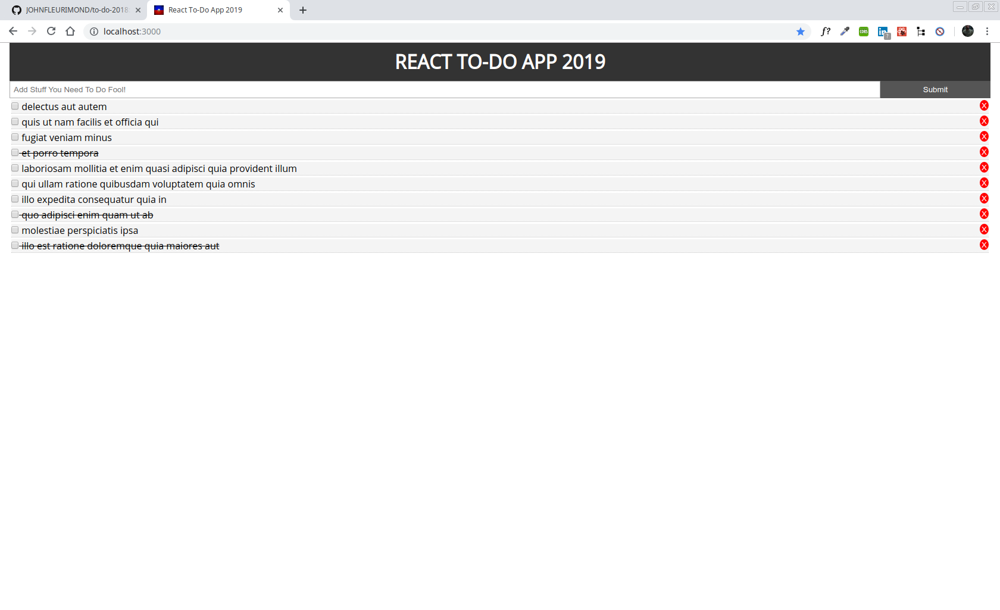

# My Awesome Project
This is a Simple React To-Do list application that allows you to keep track of things within a list as well as delete and fetch Fake JSON that is coming from a REST API .

## How It's Made:
This application is made with React.

## Optimizations.
I would like to style this better probably use Bootstrap and actually use a npm package called Postmark and receive a email when onClick.


## Lessons Learned:

No matter what my experience level, being an engineer means continuously learning. Every time I build something I always have those *whoa this is awesome* or *ahh ha moment*. During this project, I learned generate random ids with a plug in called UUID.

I learned how to use Axios to make request like Fetch API. Axios is promise-based and I could take advantage of async and await for more readable asynchronous code. This allowed me to fetch To-Do from JSON placeholders API so I wouldn't have to hard code it. I use componentDidMount() to make my request which was the first time for me .
```componentDidMount() {
  axios
    .get("https://jsonplaceholder.typicode.com/todos?_limit=10")
    .then(res =>
      this.setState({
        todos: res.data
      })
    );
}
```
Before this application I been thrown into the world of Formik which is a Node Package by Jared Palmer that handle the state of alot of things for handle event callback functions like (handleBlur, handleSubmit), setup validation, and easy error handling. So with this app I got real acquainted with state and setState.

```state = {
   title: ""
  };

  onSubmit = e => {
    e.preventDefault();
    this.props.Addtodo(this.state.title);
    this.setState({
      title: ""
    });
  };

  onChange = e =>
    this.setState({
      [e.target.name]: e.target.value
    });
    ```

I also learned how to do inline styling vs external as in just implementing it via index.css. I thought it was a separations of concerns but I guess not in React.

```import React from "react";

function Header() {
  return (
    <header style={headerStyle}>
      <h1> TodoList </h1>
    </header>
  );
}

const headerStyle = {
  background: "#333",
  color: "#fff",
  textAlign: "center",
  padding: "10px"
};

export default Header;
```
 and other fundamentals stuff such as components, state, props, JSX, events, etc.


## portfolio:

**WEBSITE:** https:/johnfleurimond.com

## Installation

1. Clone repo
2. run `npm install`

## Usage

1. run `npm start`
