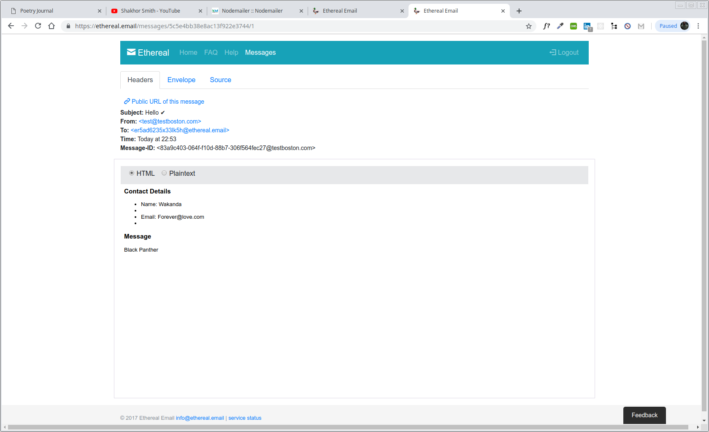

 @smithmanny

# My Awesome Project
This is a Full-Stack React Email application that allows to send emails vis Nodemailer and Axios.

## How It's Made:
This application is made with React, Axios and Nodemailer.

## Optimizations.
So this was suppose to be a simple full-stack email application but I learned one today. I couldn't get my app going when I got to I was running server side code. I kept on getting a 400 (Bad request) like my routes from front end to back end wasn't working. Which left baffled and confused...

```app.post('/api/form', (req, res) => {
  res.send('hello');
  console.log(req.data);
});
```

 Between watching video Axios POST method, reading documentation on if I was implementating it right in my handle handleChange, going on Slack and asking experts. I ended up finding help from one of the mentors thru my Resilient coder community. So, basically the reason I was getting that error, is that my server was expecting a command line variable in order to determine what port to run the server on. So this line:

`const port = process.env.PORT`

means it is looking for me to start the server with `PORT=7800 nodemon index.js`. But, I was not starting it with a command line variable, so `port` was undefined. In this case, I think express was probably picking a default port, but I wasn't not sure which port.

Then, I was running the front end with a dev server, which runs on a _different_ port, port 3000. Which means I need to "proxy" requests to my API... in other words they need to be forwarded to the proper port. React dev server takes care of that for me, and it will forward those requests to whatever port is defined in my `proxy` value in `package.json`. But, that value didn't match up to the port that my server was actually running on, so those requests were never making it to your route endpoint.

This was just didn't happen just like that, this was an all day affair. I wanted to find the best npm to handle this for my website and even after solving this I rain in more issues. I rain into a 500 error but long story short I had to end up going to the gent that actually had made this tutorial.  @smithmanny had giving me clear insight and wisdom that it was possible that my serving the server files and I had a few other issues on my part from looking at the same code for hours. I learned that I had to implement:

```
if (process.env.NODE_ENV === 'production') {
 // Exprees will serve up production assets
 app.use(express.static('client/build'));

 // Express serve up index.html file if it doesn't recognize route
 const path = require('path');
 app.get('*', (req, res) => {
   res.sendFile(path.resolve(__dirname, 'client', 'build', 'index.html'));
 });
}
```


## Lessons Learned:
I learned about running server side and client side code with React.js. It is different from when you do it in regular html, css, javascript because you're setting up express to run both files vs when using react you have create-react-app. Just a experience thing for me on configurating the files to work.

I also learned a lot about Axios and the promises it provides as well as its methods. I also learned about animated-css in this project which is a plus because one of my tech fellows suggested I should dibble and dabble in it since its on the rise!

## portfolio:

**WEBSITE:** https:/johnfleurimond.com

## Installation

1. Clone repo
2. run `npm install`

## Usage

1. run `npm run dev`
