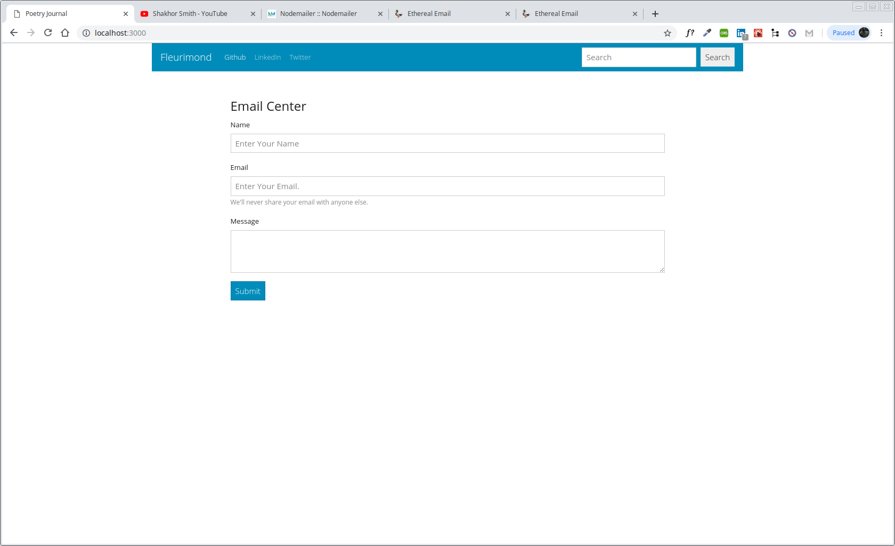

# My Awesome Project
This is a Full-Stack React Email application that allows to send emails vis Nodemailer.

## How It's Made:
This application is made with React and nodemailer.

## Optimizations.
I need to fix the POST method

## Lessons Learned:
Once I connect everything you'll hear it first

## portfolio:

**WEBSITE:** https:/johnfleurimond.com

## Installation

1. Clone repo
2. run `npm install`

## Usage

1. run `npm run dev`
